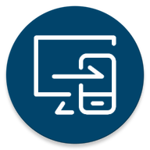

# MobPC Connector

An app to connect between your Android device and your PC.


## Description

This project effectively turns your PC into a personal server and creates a seamless wireless connection between your Android device and your PC.

It consists of two applications:
1. An application that runs on your PC and turns it into a server.
2. An Android application which communicates with that server, and which you will use most of the time. (Android Oreo 🍪 and above)

## Project Stack

#### Desktop Application
The desktop application is made using Electron, React and Typescript.

#### Android Application
The Android application is made using Kotlin and Jetpack Compose

## Features

This application will make your life easier when needing to communicate between you phone(s) and your PC(s).

The following is a non-comprehensive list of features:

1. 📂 Transfer files and folders from your phone to your PC and vice versa
2. 📋 Send text from your phone to your PC's clipboard quickly
3. 🌐 Send URLs to your PC's browser directly from your phone
4. 🗃️ Manipulate the file system on your PC directly from your phone including:
   1. Creating folders
   2. Copying, moving and deleting files
   3. more...
5. 🎥 Watch videos stored on your PC from your phone without needing to download them.
6. 🖼️ Browse images, PDF documents, and more directly from your phone 
7. 💻 Lock and shutdown your PC from your phone
8. 🌍 You can do all of the above from your home network or anywhere in the world (this is still in beta so expect it to be unpolished)
9. 🔒 The communications are over HTTPS so you will not be snooped on
10. 📱x💻 You can set up multiple servers and connect to them all from within the same app. You can also connect to your server from multiple Android devices.


## Running the project

```bash
git clone

// Run the web server
cd Server
npm i // this will take some time
npm start

cd ../Android
// Open the Android project on Android Studio and 
// run it from there on your device.
```

## How to use?

#### 1. Pairing your phone with your PC

Before you are able to do anything, you will need to pair your phone with your server. 
Open the `Devices` screen from the desktop app, and click the icon on the top right. 
This will show you a QR code that you will have to scan with your Android application. Once you scan it, your phone will be connected to your PC. 
Make sure they are on the same local network when doing this step.

#### 2. Start using the application

Once you are paired, you are ready to use the app.
You will be presented with the file system of your PC from which you can perform many operations like opening, uploading, downloading, moving or deleting files. 

You can also send text to the PC's clipboard directly from the app, or preferably do it from outside the app, by highlighing text from any app, opening the menu, and selecting `Copy to PC` which will send the text to your PC's clipboard without needing to open the app. You can do the exact thing with webpages' links, but this time select `Browse on PC` which will open the webpage on your PC's browser.


## Project status

The project is currently usable, and I use it daily myself, however, it is still not complete, and some things are buggy and not polished, but they will be fixed soon and the app will be ready for release in the upcoming future.

## Screenshots

_Screenshots will be added soon_
